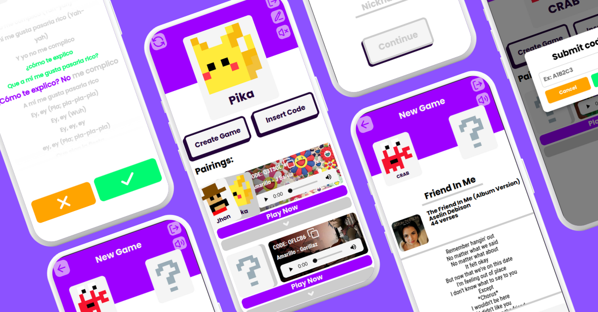

# Universo 🎶💙

**Universo** is a web application that helps couples connect emotionally through music.  
Each person can invite their partner to explore and mark song lyrics that reflect their feelings,  
creating emotional matches and strengthening their bond verse by verse.  

---

---

## 🌌 Features
- Explore songs and lyrics visually
- Select and share emotional verses with your partner
- Instant match detection when both select the same lyrics
- Clean and responsive UI with smooth transitions

## 🛠️ Technologies Used  
- **Frontend:** React + Vite  
- **Styling:** CSS Modules  
- **Backend:** Java + Spring Boot  
- **Database:** MySQL  
- **Authentication:** JWT (JSON Web Tokens)  
- **Hosting:** Render (API) + Vercel (Frontend)  
- **Deployment:** Docker  

---

🔗 **Live Demo**: [universo.coder.red](https://universo.coder.red)

---

✨ This project was created to reinforce my knowledge in both **React** and **Spring Boot**, while building something beautiful and meaningful.
